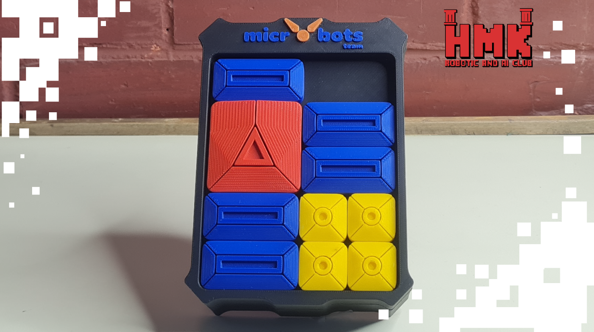

# 🧩 Klotski Block Puzzle

## 📅 Project Timeline & Context

- **Event:** FMEE 2025 – **AI & Robotics Club** Open Day
- **Date:** November 10–11–12, 2025

---

## 💡 Project Overview
The **Klotski Block Puzzle** is an **interactive smart puzzle game** designed to merge the fun of classic puzzles with modern sensing technology.  
Players must arrange the blocks of varying sizes into their correct positions **within a time limit** to complete the challenge.  

Each main puzzle piece contains an **RFID tag**, and when placed correctly, the **RFID reader** verifies the solution.  
This system adds an intelligent, interactive layer to traditional gameplay, making it suitable for **educational and exhibition environments**.

---

## ⚙️ Components Used
- **Arduino Uno** – acts as the central controller  
- **RFID Tags** – embedded inside key puzzle pieces to identify placement  
- **RFID Reader** – detects and validates the pieces’ positions  
- **Puzzle Frame and Blocks** – for the physical game setup  

---

## 💻 Software & Tools Used
- **Arduino IDE** – for programming and uploading logic to the microcontroller  
- **C/C++** – for embedded control and RFID communication  

---

## 👨‍💻 Contributors:
Special thanks to : 

- **Malek Shammout** [LinkedIn](https://www.linkedin.com/in/malek-shammout-090523337/)  

---

### 🏁 Key Features
- Smart detection using RFID technology  
- Interactive gameplay with automatic validation  
- Educational and engaging experience  
- Compact hardware integration using Arduino Uno  

---

### 🚀 Future Enhancements
- Add a digital display for timer and score tracking  
- Implement sound or LED feedback for correct/incorrect placements  
- Create multiple puzzle difficulty levels  
- Connect to a mobile or web app for progress tracking  

---

## 📸 Demo
**Coming soon!**

---

### 📜 License
This project is open-source and available under the [MIT License](LICENSE).

---

**Made with ❤️ to make classic puzzles smarter and more engaging.**
